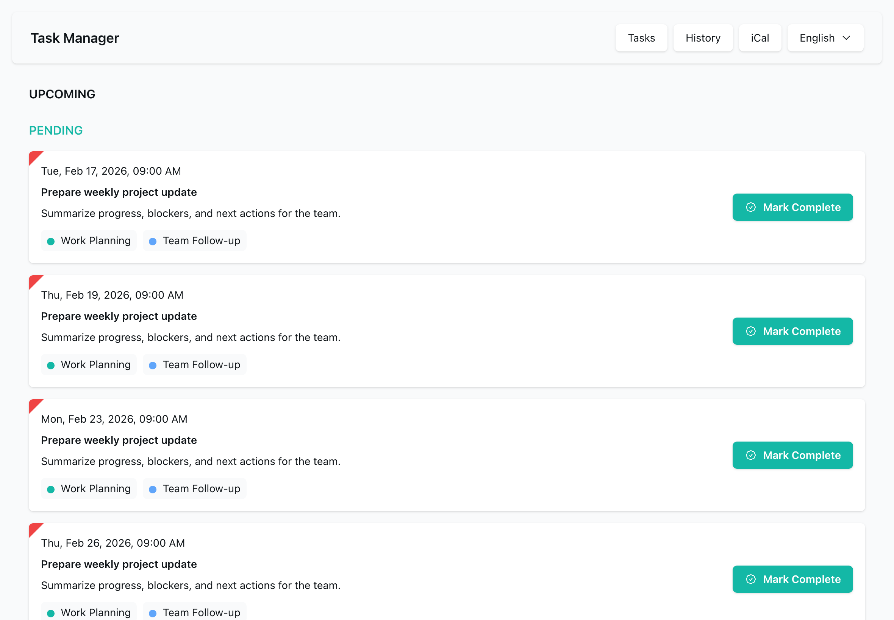

# JSCalendar Tasks

JSCalendar Tasks is a small multilingual task management app built with Next.js, Prisma, SQLite, and [`jscalendar.ts`](https://github.com/craft-guild/jscalendar).

This project is designed to provide a **real-world example of how JSCalendar data can be created, stored, expanded, and edited in an application**. It is intended to be more than a toy recurrence demo. The app shows how tasks are persisted, tagged, completed, filtered by history month, and exposed through an iCalendar endpoint.



## Quick Start

The Docker image is the recommended way to run JSCalendar Tasks outside local development.

Run the container:

```bash
docker run --rm -p 3000:3000 ghcr.io/craftguild/jscalendar-tasks:latest
```

Then open `http://localhost:3000`.

The container entrypoint runs `prisma migrate deploy` before starting the standalone Next.js server. By default, SQLite data is stored at `/app/data/jscalendar-tasks.db`, and attachments are stored at `/app/data/attachments`.

For persistent data, mount a Docker volume or host directory to `/app/data`. The image is also published with commit-specific tags such as `sha-50bcf51`; use `latest` for a quick trial and a `sha-...` tag when you need to reproduce a specific build.

Set `DEMO_MODE=true` to show a public demo notice on the top page. Demo databases can be reset from cron with:

```bash
DEMO_MODE=true npm run db:reset-demo
```

## Why This Project Exists

`jscalendar.ts` provides a practical TypeScript implementation of the JSCalendar model. JSCalendar Tasks is intended to show how that model can be used in a product-like workflow:

- Creating task records as JSCalendar objects.
- Storing JSCalendar payloads as JSON through Prisma.
- Mapping form input to `RecurrenceRule`.
- Expanding recurring tasks into concrete occurrences.
- Handling completed occurrences separately from the source task.
- Exporting events through an iCalendar-compatible endpoint.

If you are evaluating JSCalendar for a real application, this repository is intended to help you understand one possible architecture.

## Features

- Task creation and editing.
- One-time and recurring tasks.
- Daily, weekly, monthly, and yearly recurrence schedules.
- Weekly recurrence rules with multiple weekdays.
- Monthly recurrence rules by day of month or nth weekday.
- Completion registration for individual occurrences.
- Completion history grouped and filtered by month.
- Tags with per-task tag colors.
- Attachments for completion records.
- Infinite scrolling for upcoming occurrences.
- iCalendar feed endpoint.
- Multilingual UI with English as the default and fallback locale.
- UI language support for English, Japanese, Simplified Chinese, Traditional Chinese, Korean, French, German, and Spanish.
- Noto Sans based web font stack for consistent multilingual rendering.

## Local Development

The following commands set up the local database, insert sample data, and start the development server:

```bash
npm install
cp .env.example .env
npm exec prisma generate
npm exec prisma migrate dev
npm exec prisma db seed
npm run dev
```

The seed data inserts two work-related tags and two work-related tasks for each supported language. Each seeded task is linked to multiple tags, recurrence rules are randomized on each seed run, and task start dates are spread across past and future dates.

Then open `http://localhost:3000`.

## Architecture

JSCalendar Tasks keeps JSCalendar at the center of the task workflow. The application form collects task fields and recurrence settings, then maps them into a JSCalendar `Task` object. The resulting JSCalendar payload is stored as JSON through Prisma, so the original scheduling model remains available for later expansion and export.

Upcoming tasks are displayed by expanding the stored JSCalendar data into concrete occurrences. Completion records are stored separately from the source task, which makes it possible to mark one occurrence as completed without changing the recurrence rule itself. The history page reads those completion records and groups them by month.

The iCalendar endpoint uses the same stored task data as the application UI. This keeps the app UI, occurrence expansion, completion history, and calendar export aligned around the same JSCalendar source data.

In short, the flow is:

- Form input.
- JSCalendar `Task`.
- Prisma JSON storage.
- Occurrence expansion.
- Completion records.
- iCalendar export.

## Useful Commands

Run lint:

```bash
npm run lint
```

Build the app:

```bash
npm run build
```

Run tests:

```bash
npm test
```

Run the production server after building:

```bash
npm run start
```

## Release Helpers

The repository includes a minimal Makefile for environments where Docker is not available. The systemd files are provided as a fallback deployment option for Linux hosts that cannot run Docker; for production deployments, the Docker image is the primary supported path.

Generate the Prisma client and build the standalone Next.js output:

```bash
make
```

Install the standalone output, default environment file, and systemd unit on Linux:

```bash
make install
```

## Code of Conduct

See `CODE_OF_CONDUCT.md`.

## Contributing

See `CONTRIBUTING.md`.

## License

See `LICENSE`.
